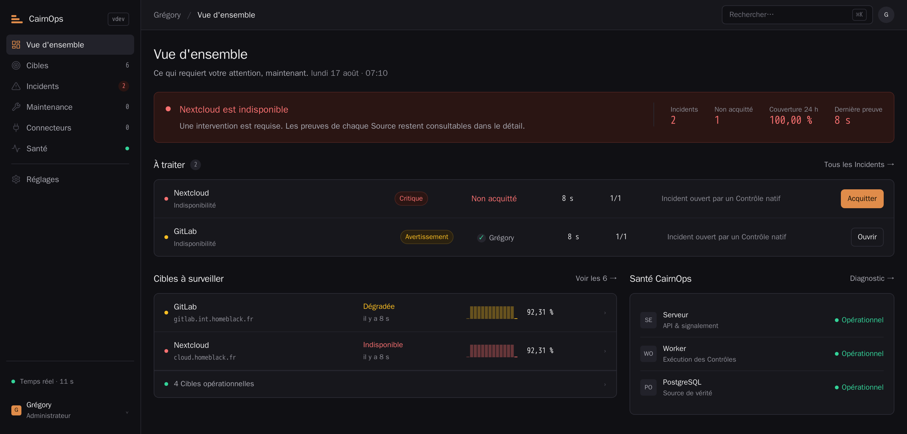

# CairnOps

> Supervision self-hosted, état partagé, incidents compréhensibles.

CairnOps supervise en permanence les services depuis son déploiement serveur et
maintient un état opérationnel commun entre le Web, iOS et Android. Le projet
cherche à réunir la simplicité d'un outil d'uptime et la rigueur d'un véritable
poste de conduite, sans agent distant ni administration de l'infrastructure en
V1.



## État du projet

CairnOps possède une **fondation exécutable** : serveur et worker Go, migrations
PostgreSQL, ordonnanceur à baux, contrôles HTTP, TCP, DNS, ICMP et Heartbeat,
premier démarrage sécurisé, configuration des Cibles, signalement WebSocket
versionné, Santé CairnOps, interface SvelteKit statique et déploiement Docker
Compose. Le premier parcours de Connecteur Zabbix vérifie désormais l'API et le
transport, présente les hôtes découverts puis importe explicitement les Cibles
sans doublon exact. Le serveur interroge ensuite Zabbix en continu, projette ses
problèmes dans des Incidents CairnOps, les résout au rétablissement et propage
les acquittements vers Zabbix sans perdre l'action locale en cas d'indisponibilité.
Uptime Kuma suit le même parcours d'aperçu et d'import via son endpoint métriques
officiel et une clé API dédiée ; ses états DOWN ouvrent des Incidents, résolus au
retour UP. Le webhook générique génère son propre secret et retient toute identité
inconnue en quarantaine jusqu'à sa liaison explicite à une Cible. Le cycle Incident
conserve maintenant les preuves invalidées avec leur motif ; les fenêtres de
maintenance neutralisent la projection sans suspendre la collecte. Mattermost est
relié par un webhook HTTPS scellé et une boîte d'envoi durable qui respecte
Gravité, Acquittement et Résolution. Les Contrôles natifs alimentent désormais le
même cycle Incident : chaque Source possède sa Politique de déclenchement, ouvre
un Incident après assez d'Observations défavorables consécutives et le résout
après confirmation du rétablissement, sans qu'une Observation Inconnue ne conclue
quoi que ce soit. Disponibilité, Couverture et latence se mesurent sur 24 heures
dans les listes, puis sur 7 et 30 jours dans le détail, à partir d'agrégats
horaires consolidés par le worker. Une instance ne vit plus avec le seul compte
né de sa mise en service : un Administrateur ouvre des comptes Opérateur et
Observateur, change un rôle et retire un accès, sans jamais effacer un compte ni
laisser l'instance sans Administrateur actif. Le backend mobile sait désormais
associer et révoquer chaque appareil, chiffrer sa projection Push et la remettre
au Relais officiel avec reprise par appareil. Le compagnon iOS sait scanner ou
recevoir le lien d'appairage, attendre la confirmation Web, conserver son
identité dans Keychain et authentifier durablement REST et WebSocket. Il demande
ensuite l'autorisation système, inscrit et renouvelle son jeton APNs auprès du
Relais, puis déchiffre localement l'enveloppe dans une extension de notification
avant affichage. Le Relais APNs officiel possède son stockage chiffré, son image
Docker et ses contrats de création, rotation, suppression et livraison. Le
compagnon Android reste à construire avant la V1 multiplateforme.

Ce dépôt partagé contient le serveur, le worker, l’interface Web, le Relais Push
et leurs contrats. Le code du compagnon iOS est maintenu séparément et n’est pas
inclus dans cette distribution.

## Ce que vise la V1

- contrôles natifs HTTP/HTTPS, TCP, ICMP, DNS et Heartbeat, exécutés côté serveur ;
- intervalles de contrôle de 20 secondes à 24 heures ;
- incidents, acquittements, invalidations et journal d'activité partagés en temps réel ;
- connecteurs guidés pour Zabbix et Uptime Kuma, plus un webhook générique ;
- notifications intégrées, Push iOS/Android et Mattermost ;
- déploiement Docker Compose avec serveur, worker et PostgreSQL séparés ;
- interface Web d'administration et compagnons mobiles opérationnels ;
- français et anglais, thèmes clair et sombre.

Le périmètre complet et ses limites sont décrits dans
[docs/V1-SCOPE.md](docs/V1-SCOPE.md).

## Architecture retenue

| Élément | Choix |
| --- | --- |
| Serveur et worker | Go |
| Interface Web | Svelte + SvelteKit, compilation statique servie par Go |
| Stockage | PostgreSQL |
| Synchronisation | API REST et signalement WebSocket |
| Déploiement | Docker Compose multi-conteneurs |
| Mobile | Applications natives iOS et Android |
| Push | Enveloppes X25519 + XChaCha20-Poly1305 vers un destinataire de relais opaque |
| Licence | GNU AGPL v3.0 |

Le serveur reste la source de vérité. Les interfaces projettent le même état et
ne concluent jamais qu'une cible va bien faute de preuve récente.

## Lire le projet

- [Langage et modèle de domaine](CONTEXT.md)
- [Périmètre fonctionnel de la V1](docs/V1-SCOPE.md)
- [Direction de design](docs/DESIGN-DIRECTION.md)
- [Décisions d'architecture](docs/adr/)
- [Contrat du Relais Push](docs/api/push-relay.yaml)
- [Format de chiffrement Push](docs/api/push-encryption.md)

La référence visuelle est la maquette « CairnOps — Écrans » : huit écrans en
sombre et en clair, dont la traduction en jetons vit dans
`web/src/styles/app.css`.

## Démarrer la fondation locale

Prérequis : Docker avec le plugin Compose v2.

```shell
cp .env.example .env
# Renseignez ensuite CAIRNOPS_BOOTSTRAP_TOKEN avec : openssl rand -base64 32
docker compose up --build
```

L'interface est alors disponible sur <http://localhost:8080>. Au premier accès,
elle demande le Jeton d'amorçage pour créer l'unique premier Administrateur ;
ce jeton ne permet ensuite plus d'accéder à l'administration. Le mot de passe
PostgreSQL fourni par défaut est réservé au développement local : remplacez-le
dans `.env` avant toute exposition réseau et définissez `CAIRNOPS_PUBLIC_URL`
avec l'origine HTTPS réellement utilisée.

Le worker active la livraison mobile lorsque `CAIRNOPS_PUSH_RELAY_URL` contient
l'origine HTTPS du Relais officiel. Sans cette variable, les identités mobiles
restent utilisables mais le composant Push apparaît indisponible dans la Santé.
Le profil Compose `push` lance le Relais APNs localement lorsqu'une clé `.p8`,
son Key ID et le Team ID Apple sont fournis ; cette clé reste montée en lecture
seule et n'entre jamais dans une image. Chaque inscription conserve aussi
l'environnement APNs du profil signé, afin qu'un build de développement et un
build de production utilisent automatiquement le bon endpoint Apple.

Endpoints utiles :

- `GET /api/v1/health/live` : processus serveur actif ;
- `GET /api/v1/health/ready` : serveur prêt et PostgreSQL joignable ;
- `GET /api/v1/system/health` : état authentifié du serveur, des workers, de PostgreSQL et du Push ;
- `POST /api/v1/device-pairings` : invitation Web à usage unique pour associer un appareil ;
- `POST /api/v1/device-pairings/claim` : revendication mobile avant confirmation Web ;
- `GET /api/v1/devices` : appareils individuels actifs ou révoqués, sans leurs secrets ;
- `GET /api/v1/events` : WebSocket authentifié avec reprise par version ;
- `GET /api/v1/connectors` : Connecteurs persistés sans leurs secrets ;
- `POST /api/v1/connectors/zabbix/preview` : vérification et aperçu Zabbix ;
- `POST /api/v1/connectors/zabbix/import` : confirmation explicite de l'import ;
- `POST /api/v1/connectors/uptime-kuma/preview` : vérification de `/metrics` et aperçu Kuma ;
- `POST /api/v1/connectors/uptime-kuma/import` : import explicite des moniteurs sélectionnés ;
- `POST /api/v1/connectors/patchmon/preview` : vérification en lecture seule et aperçu de la posture des hôtes ;
- `POST /api/v1/connectors/patchmon/import` : import explicite des hôtes, hors calcul de disponibilité ;
- `POST /api/v1/connectors/generic-webhook` : création et affichage unique du secret entrant ;
- `POST /api/v1/webhooks/{publicID}` : réception authentifiée, autorisée ou mise en quarantaine ;
- `GET /api/v1/connectors/{connectorID}/quarantine` : identités inconnues en attente ;
- `POST /api/v1/connectors/{connectorID}/quarantine/{quarantineID}/approve` : liaison et rejeu explicites ;
- `GET /api/v1/incidents` : projection partagée des Incidents actifs ou résolus ;
- `GET /api/v1/incidents/{incidentID}` : preuves et Journal d'activité d'un Incident ;
- `POST /api/v1/incidents/{incidentID}/acknowledgement` : acquittement local puis propagation vers la Source ;
- `GET /api/v1/version` : informations du build.

Le worker reçoit uniquement la capacité Linux `NET_RAW`, nécessaire aux sondes
ICMP lorsque les sockets ping non privilégiées ne sont pas disponibles. Il
reste non-root et le profil Compose interdit toute élévation supplémentaire.
Chaque worker utilise son nom d'hôte de conteneur comme identité de bail, ce qui
permet d'en multiplier le nombre sans exécuter deux fois le même contrôle.

## Amorcer l'Espace opérationnel

Le Jeton d'amorçage n'ouvre que deux portes, toutes deux hors session : la
création du premier Administrateur, et le rétablissement d'un accès perdu. Il ne
donne accès à aucune donnée de supervision. Il doit contenir au moins 32
caractères, ne possède aucune valeur par défaut, et comme toute information
d'authentification il ne doit circuler qu'en HTTPS dès que CairnOps est exposé
hors de la machine locale — conservez-le après l'initialisation.

Le parcours Web guide cette opération. L'équivalent API est disponible pour les
déploiements automatisés :

```shell
curl --fail-with-body --cookie-jar cairnops.cookies \
  -H "Authorization: Bearer ${CAIRNOPS_BOOTSTRAP_TOKEN}" \
  -H "Content-Type: application/json" \
  --data '{"username":"admin","display_name":"Administrateur","password":"remplacez-par-une-phrase-secrete"}' \
  http://localhost:8080/api/v1/setup
```

Les appels administratifs suivants utilisent uniquement le cookie de session
HttpOnly obtenu, par exemple avec `curl --cookie cairnops.cookies`. Les mots de
passe sont dérivés avec Argon2id et les jetons de session ne sont conservés en
base que sous forme d'empreinte SHA-256 révocable.

## Mots de passe

Trois chemins mènent à un nouveau mot de passe, et ils diffèrent seulement par
ce qu'ils exigent en preuve. Chacun révoque les sessions ouvertes du compte
concerné : un mot de passe que l'on remplace est souvent un mot de passe que
l'on soupçonne.

- **Changer le sien** depuis Réglages, en fournissant l'actuel. Ouvert à tous
  les rôles. Votre propre session est rouverte pour ne pas vous éjecter.
- **Réinitialiser celui d'un compagnon** depuis Réglages, réservé aux
  Administrateurs. Le mot de passe s'affiche une fois ; transmettez-le hors de
  CairnOps.
- **Rétablir un accès perdu** depuis l'écran de connexion, lien « J'ai perdu
  l'accès ». Cette porte existe pour le cas où plus aucun compte ne peut ouvrir
  de session, que l'interface est donc incapable de réparer seule. Le Jeton
  d'amorçage y tient lieu de preuve : il établit que vous contrôlez le
  déploiement. Un identifiant inconnu répond comme un jeton refusé, afin de ne
  pas révéler quels comptes existent.

Le WebSocket ne transporte aucune commande : il annonce les changements avec
un numéro de version monotone, puis l'interface recharge la projection REST
concernée. Après une coupure, le client reprend à sa dernière version connue ;
un premier chargement démarre au curseur courant sans rejouer tout l'historique.

La création d'une Source Heartbeat renvoie son secret et son chemin une seule
fois. CairnOps n'en conserve qu'une empreinte SHA-256 et masque ce chemin dans
ses journaux HTTP. Les jetons de Connecteur sont scellés par une clé maîtresse
AES-256-GCM créée automatiquement dans le volume `cairnops-secrets` ; cette clé
reste hors de PostgreSQL et doit être sauvegardée avec la base. L'aperçu Zabbix
utilise un reçu opaque valable quinze minutes, puis revalide les hôtes au moment
de l'import. Une fois importé, le Connecteur est synchronisé par le serveur selon
un bail PostgreSQL : une erreur distante dégrade le Connecteur mais ne résout
jamais les Incidents faute de preuve. Le contrat complet de cette API est décrit dans
[docs/api/openapi.yaml](docs/api/openapi.yaml).

Le Connecteur Uptime Kuma utilise uniquement l'endpoint Prometheus `/metrics`
et sa clé API en lecture. Il n'emploie pas l'API Socket.IO interne, non garantie
pour les intégrations tierces. Les états PENDING et MAINTENANCE restent neutres ;
DOWN ouvre un Incident et UP le résout après une nouvelle preuve serveur.

Le webhook générique sépare l'authentification du canal et la confiance accordée
à une identité métier. Son secret Bearer de 256 bits est affiché une fois puis
scellé ; une identité inconnue reçoit une réponse `202 quarantined` mais ne peut
affecter l'état opérationnel. Après autorisation, `firing` ouvre ou actualise le
signal identifié par `event_key` et seule une entrée `resolved` explicite le ferme.

Chaque Source de signal native porte sa Politique de déclenchement : trois
Observations défavorables consécutives ouvrent un Incident et deux Observations
saines consécutives le résolvent par défaut, avec une Gravité `major`. Ces trois
valeurs se règlent à la création de la Source, entre 1 et 10 pour les seuils. Une
Observation Inconnue laisse les compteurs intacts : elle ne déclenche pas et ne
constitue jamais un rétablissement. Les preuves natives rejoignent la Nature
`availability`, de sorte que plusieurs Sources d'une même Cible alimentent un
Incident unique, invalidable et notifié comme les preuves d'une Intégration.

Une Cible se corrige et se retire sans perdre son passé. Renommer ne change ni
son identité ni son historique ; archiver la sort du service en résolvant ses
Incidents actifs, en arrêtant ses Contrôles et en refusant tout signal qui
voudrait la rouvrir — y compris celui d'une Intégration encore active — jusqu'à
sa restauration. Un Contrôle natif se modifie entièrement, configuration
comprise : corriger une URL n'oblige ni à recréer la Source ni à perdre ses
Observations. Le suspendre l'arrête sans rien perdre ; le retirer emporte ses
Observations. Une Source apportée par une Intégration ne se règle pas ici : elle
appartient au produit distant.

Une Cible importée depuis un Connecteur se mesure comme les autres : chaque
liaison porte une Source de signal, et chaque cycle de synchronisation y
enregistre une Observation — indisponible, disponible avec son temps de réponse,
ou neutre pour les états PENDING et MAINTENANCE d'Uptime Kuma. Ces Observations
alimentent la mesure et elle seule : l'Incident d'une Intégration reste décidé
par le rapprochement de ses propres signaux.

Trois mesures répondent à trois questions distinctes. La Disponibilité est la
part des Observations concluantes qui ont conclu à la disponibilité. La
Couverture est la part des Observations attendues qui ont effectivement conclu :
une Observation Inconnue, une sonde suspendue ou un worker absent la font
baisser, de sorte qu'une Disponibilité de 100 % adossée à une Couverture de 4 %
se voit plutôt qu'elle ne rassure. La latence est la moyenne exacte et le
maximum des Observations saines ; aucun percentile n'est annoncé, faute de
pouvoir l'agréger sans approximation. Le worker consolide chaque heure révolue,
l'heure en cours se lisant sur les Observations brutes : une consolidation en
retard ne rend donc aucune mesure fausse. Une fenêtre de maintenance neutralise
la projection opérationnelle mais ne réécrit pas la mesure.

Pour travailler sans conteneuriser les builds :

```shell
make bootstrap
make check
make build
```

## Contribuer

Le cœur du produit est encore en cours de construction. Les retours sur le
modèle, le périmètre et les décisions existantes sont bienvenus sous forme
d'issue. Consultez [CONTRIBUTING.md](CONTRIBUTING.md) avant de proposer une
modification et [SECURITY.md](SECURITY.md) pour signaler une vulnérabilité.

## Licence

CairnOps est distribué sous la
[GNU Affero General Public License v3.0](LICENSE). Les polices IBM Plex livrées
avec l'interface, en repli de `system-ui`, conservent leur propre licence,
disponible dans
[web/static/fonts/LICENSE-IBM-PLEX.txt](web/static/fonts/LICENSE-IBM-PLEX.txt).
